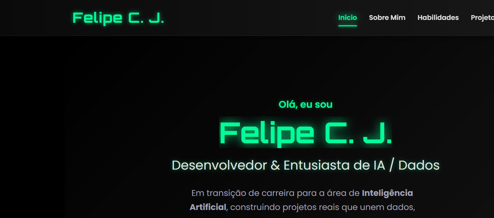

# 👨‍💻 Portfólio — Felipe Caires Jaques

[](https://developer.mozilla.org/docs/Web/HTML)
[](https://developer.mozilla.org/docs/Web/CSS)
[](https://developer.mozilla.org/docs/Web/JavaScript)
[](LICENSE)

> Site de portfólio pessoal (one-page) de Felipe Caires Jaques — desenvolvedor em transição
> para a área de **IA e dados**. Visual moderno com tema neon, e uma seção de projetos que
> **integra automaticamente todos os repositórios públicos** via API do GitHub.

## 🖼️ Preview



## ✨ Destaques

- 🎬 **Hero animado** com efeito de digitação (*typewriter*)
- 🧠 **Sobre Mim** e **Habilidades** com barras de progresso animadas
- ⭐ **Projetos em destaque** com screenshots reais (carregadas direto do GitHub)
- 🔄 **Integração com a API do GitHub** — os repositórios públicos são listados e
  atualizados **automaticamente** (nome, descrição, linguagem, tópicos e estrelas)
- ✉️ **Contato** com formulário (abre o e-mail via `mailto`) e links de LinkedIn/GitHub
- 📱 **Responsivo** e com **acessibilidade** (navegação por teclado, ARIA, scroll-spy)

## 🛠️ Tecnologias

HTML5 · CSS3 (variáveis, grid, animações) · JavaScript (Vanilla) · GitHub REST API · Font Awesome · Google Fonts

## 🚀 Como rodar

Por usar a API do GitHub via `fetch`, recomenda-se servir os arquivos (em vez de abrir o
`index.html` direto pelo `file://`):

```bash
# na pasta do projeto
python -m http.server 8000
# acesse http://localhost:8000
```

## 📂 Estrutura

```
├── index.html   # estrutura e conteúdo
├── style.css    # tema neon, layout responsivo e animações
└── script.js    # typewriter, animações, integração com a API do GitHub e contato
```

## 📄 Licença

Distribuído sob a licença **MIT**. Veja [LICENSE](LICENSE).
